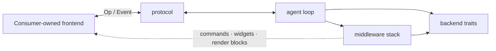

# Horus

Horus is a small Rust framework for building coding agents. It provides one asynchronous agent
loop, an ordered middleware pipeline, a frontend-neutral protocol, and replaceable model,
sandbox, and checkpoint backends.

| Package | Purpose |
| --- | --- |
| [`horus`](https://crates.io/crates/horus) | Frontend-neutral agent framework |
| [`horus-cli`](https://crates.io/crates/horus-cli) | Reference terminal coding agent |



## Install

Download the matching archive and checksum from
[GitHub Releases](https://github.com/citizenhicks/horus/releases):

- Apple Silicon macOS: `aarch64-apple-darwin`
- x86_64 Linux: `x86_64-unknown-linux-gnu`

Verify with `shasum -a 256 -c FILE.sha256`, extract the archive, and put `horus` on your
`PATH`. Rust users and other macOS or Linux architectures can build locally:

```sh
cargo install horus-cli
```

Run `horus`. The first launch opens the provider and middleware setup flow, then creates
`~/.horus/config.toml` and `~/.horus/horus.sqlite3`.

To run the workspace directly:

```sh
cargo run -p horus-cli
```

See the
[CLI guide](https://github.com/citizenhicks/horus/blob/main/crates/horus-cli/README.md)
for providers, local state, and TUI behavior.

## Framework

Horus requires Rust 1.89 or newer.

```toml
[dependencies]
horus = "0.1"
```

The caller owns composition:

```rust,no_run
use std::path::Path;
use std::sync::Arc;

use horus::Result;
use horus::agent::{Agent, AgentConfig, create_agent};
use horus::backend::checkpoint::{CheckpointStore, sqlite::SqliteCheckpoint};
use horus::backend::model::{Model, ModelRouter, openai::OpenAi};
use horus::backend::sandbox::{ApprovalPolicy, Sandbox, local::LocalSandbox};
use horus::middleware::{Middleware, MiddlewareStack};
use horus::middleware::tools::Tools;

async fn build_agent(
    workspace: &Path,
    api_key: String,
    model_id: &str,
) -> Result<Agent> {
    let model: Arc<dyn Model> = Arc::new(OpenAi::new(
        api_key,
        "https://api.openai.com/v1",
        model_id,
    )?);
    let models = Arc::new(ModelRouter::new("default", model));
    let sandbox = Arc::new(Sandbox::new(
        Arc::new(LocalSandbox::new(workspace)?),
        ApprovalPolicy::On,
    ));
    let checkpoints: Arc<dyn CheckpointStore> =
        Arc::new(SqliteCheckpoint::new(workspace.join("horus.sqlite3"))?);
    let middleware: Vec<Arc<dyn Middleware>> = vec![Arc::new(Tools::coding())];

    create_agent(AgentConfig::new(
        models,
        sandbox,
        checkpoints,
        MiddlewareStack::new(middleware)?,
        "You are a concise coding agent.",
    ))
    .await
}
```

Frontends submit
[`protocol::Op`](https://docs.rs/horus/latest/horus/protocol/enum.Op.html) values and consume
events from `Agent`. Framework capabilities may also contribute frontend-neutral commands,
references, widgets, and rendered blocks. A frontend decides how those contributions look;
capability implementations do not depend on terminal code. Interrupts target a specific turn, and
events carry an optional submission ID so command-driven and unsolicited system events remain
distinct.

## Modules

| Module | Owns |
| --- | --- |
| `agent` | Session handles and the linear command/model/tool loop |
| `middleware` | Lifecycle hooks, tools, skills, steering, compaction, sessions, and subagents |
| `protocol` | Commands, events, approvals, usage, and UI-neutral contribution records |
| `backend` | Model, sandbox, and checkpoint interfaces plus built-in adapters |

Middleware declaration order is execution order. A loop may run with no optional middleware.
The sandbox enforces approval policy for every approval-required tool.
Static middleware prompt fragments are composed into the system prompt once when an agent is
created; runtime hooks do not repeatedly append them to conversation state. Built-in middleware
that contributes instructions exposes a `prompt` builder override while retaining its own default.
Subagents may set default model and reasoning choices at construction, with per-spawn overrides.
Compaction defaults to 250,000 tokens. Its middleware uses a provider's native endpoint when
advertised; otherwise it creates a rolling summary while retaining recent raw context.
Checkpoint backends expose cursor-paginated session catalogs and sequence-bounded transcript
pages. `AgentConfig::initial_replay_batches` controls the recent history rendered on resume;
the complete compacted model checkpoint is loaded independently.

The local command sandbox currently uses Seatbelt on macOS and Bubblewrap on Linux. If the
platform sandbox is unavailable, command execution fails closed. The sandbox offers three
approval policies: prompt before dangerous tools, allow tools without network, or allow tools with
network. Filesystem confinement remains active in every mode.

## Contributing

Read [AGENTS.md](AGENTS.md) before changing the framework. It defines module ownership,
capability extension points, required checks, and the no-compatibility rule for this initial
release.

Release tags are intentionally separate:

- `horus-vX.Y.Z` publishes the framework crate and creates its GitHub Release.
- `horus-cli-vX.Y.Z` publishes the CLI crate and attaches downloadable binaries to a GitHub
  Release.

Publish `horus` first and wait for it to appear in the crates.io index, because `horus-cli`
depends on that release. Creating a tag is a release action; ordinary pushes and pull requests
only run CI. The release workflow expects a `CARGO_REGISTRY_TOKEN` repository secret for the
initial crates.io publications.

## License

Licensed under [Apache-2.0](LICENSE). See [NOTICE](NOTICE) for attribution to
[OpenAI Codex](https://github.com/openai/codex), Ratatui-derived work, and the
[Sora](https://github.com/Aejkatappaja/sora) color palette.


